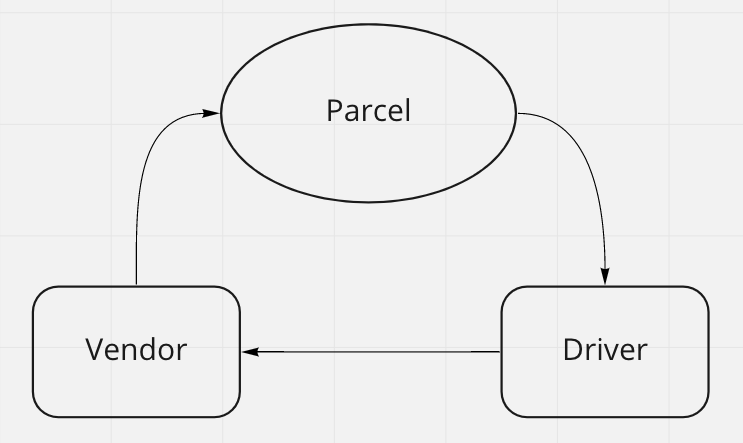

# caps

## Authors

Antoine Charette

## Problem Domain

Make a small app with three files in which you send a message from a Vendor file to a Driver file and then a final message back to the Vendor. This is an example of event driven programming.

## Diagrams

